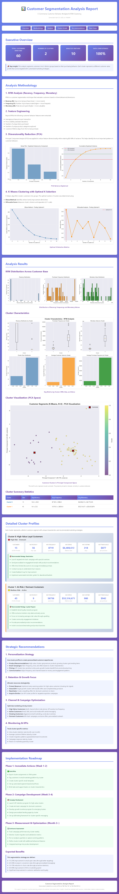

# Customer Segmentation with Clustering

Segments e-commerce customers using K-Means clustering, PCA, and RFM
(Recency, Frequency, Monetary) analysis on 2+ years of purchase history.

## Key Findings
- Feature-engineered RFM metrics from raw transaction history
- Applied PCA for dimensionality reduction before clustering
- Used Elbow Method and Silhouette Score to select optimal K
- Segmented customers into behavioral clusters (e.g. High-Value Loyal, At-Risk/Dormant)
  with tailored retention and marketing recommendations per cluster

## What I Did
- Engineered RFM features from purchase history
- Reduced dimensionality with PCA and validated cluster count with Elbow/Silhouette methods
- Ran K-Means clustering and profiled each cluster's spend, frequency, and risk level
- Delivered strategic recommendations mapped to a phased implementation roadmap

## Report Preview

## Tools
Python · scikit-learn · pandas · matplotlib · behavioral analytics
